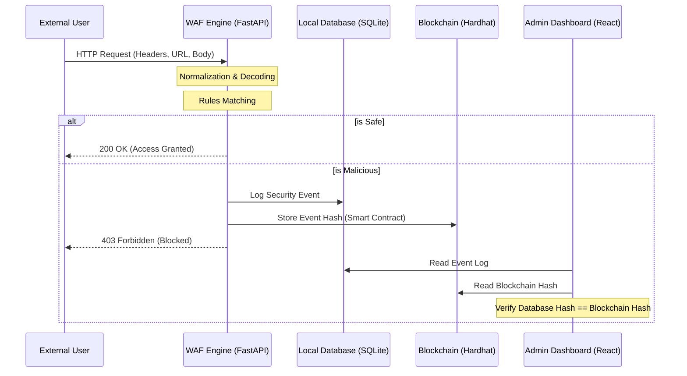

# Blockchain-Secured Web Application Firewall (WAF)

A modern, enterprise-grade Web Application Firewall built with React, FastAPI, and Ethereum/Hardhat. This project demonstrates a highly secure architecture where a WAF independently inspects traffic for malicious payloads and logs security events to a local blockchain, providing a mathematically verifiable, tamper-evident audit trail.

## 🚀 Project Overview

Standard WAFs store their security logs in centralized databases, which can be modified or deleted by an attacker if the database is compromised. 

This project solves this problem by integrating a **tamper-evident audit layer**:
1. Incoming requests are normalized and deep-inspected by the WAF Engine.
2. Malicious payloads are detected and blocked.
3. A security event is generated and hashed.
4. The event hash is instantly recorded as a smart contract transaction on an Ethereum (Hardhat) network.
5. The SOC dashboard can mathematically verify the integrity of the local database log against the immutable blockchain record.

## 🛡️ Architecture & Threat Detection

### Flow Diagram



### Detection Capabilities

The WAF engine independently detects the following threats in the URL, query parameters, headers, or request body:

- **SQL Injection**: Detects common operators (`OR '1'='1'`), standard SQL commands (`SELECT`, `UNION`, `DROP`), and comment-based injection.
- **Cross-Site Scripting (XSS)**: Identifies malicious script tags (`<script>`), `javascript:` handlers, and unauthorized `eval()` payloads.
- **Path Traversal**: Blocks attempts to break out of application directories (e.g., `../../etc/passwd`).
- **Command Injection**: Identifies shell concatenation operators (`;`, `&&`, `|`) and system execution functions (`system()`, `exec()`).

*Note: The frontend does not classify attacks. The WAF deeply inspects the raw HTTP payload dynamically.*

## 💻 Technology Stack

- **Frontend**: React, Vite, Tailwind CSS, Lucide Icons (Professional Enterprise Slate Theme).
- **Backend / WAF Engine**: Python, FastAPI, SQLAlchemy, SQLite.
- **Blockchain**: Hardhat, Ethers.js, Solidity Smart Contracts.

## 🛠️ Getting Started

### 1. Start the Blockchain Node
```bash
cd blockchain
npm install
npx hardhat node
```
*(Leave this terminal running. The node provides local test accounts and an RPC endpoint at `http://127.0.0.1:8545`)*

### 2. Deploy Smart Contracts (In a new terminal)
```bash
cd blockchain
npx hardhat run scripts/deploy.js --network localhost
```
*(Copy the deployed contract address into your backend `.env` configuration if required).*

### 3. Start the Backend WAF API
```bash
cd backend
python -m venv venv
# Windows: .\venv\Scripts\activate
# Mac/Linux: source venv/bin/activate
pip install -r requirements.txt
uvicorn app.main:app --reload --port 8000
```

### 4. Start the Frontend Dashboard
```bash
cd frontend
npm install
npm run dev
```

## 🧪 Testing the WAF

1. Navigate to the **Protected Application** demo (`http://localhost:5173/demo`).
2. Log in with a standard credential (`admin` / `admin123`). The WAF will allow the request.
3. Test an attack payload: Try entering `admin' OR '1'='1` in the username or password field. 
4. The WAF will independently parse the body, flag the `SQL_INJECTION` threat, block the request, and generate an immutable audit log.
5. Navigate to the **Security Events** dashboard to view the generated log and click **Verify Integrity** to mathematically prove the event was recorded on the local blockchain.

---
*Developed for advanced security and compliance auditing.*
